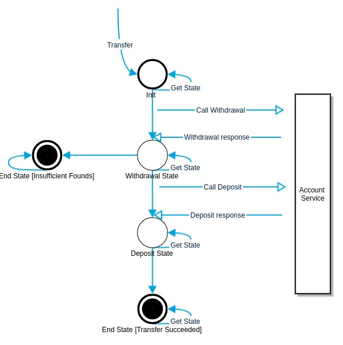

# Wallet Rest Api

**Get account balance**
----
  Returns json data with current balance.

* **URL**

  /account/:id

* **Method:**

  `GET`

*  **URL Params**

   **Required:**

   `id=[integer]`

* **Data Params**

  None

* **Success Response:**

  * **Code:** 200  
    **Content:** `{ "balance": 1001 }`

* **Error Response:**

**Deposit new funds to account**
----
  Returns json data with deposit effects.

* **URL**

  /account/:id/deposit

* **Method:**

  `POST`

*  **URL Params**

   **Required:**

   `id=[integer]`

* **Data Params**

  `amount: [integer]`

* **Success Response:**

  * **Code:** 200  
    **Content:** `{ "change": 1001, "currentBalance":1001 }`

* **Error Response:**

**Withdraw some funds from account**
----
  Returns json data with withdrawal effects.

* **URL**

  /account/:id/dewithdrawposit

* **Method:**

  `POST`

*  **URL Params**

   **Required:**

   `id=[integer]`

* **Data Params**

  `amount: [integer]`

* **Success Response:**

  * **Code:** 200  
    **Content:** `{ "change": 1001, "currentBalance":1001 }`

* **Error Response:**

  * **Code:** 400  
    **Content:** `{ "change": 10001, "currentBalance":1001, "msg":"Insufficient Funds" }`

**Transfer funds from account A to account B **
----
  Returns json data with unique transaction id, and transaction effect for donor account.

* **URL**

  /account/:donorId/transfer/:recipientId

* **Method:**

  `POST`

*  **URL Params**

   **Required:**

   `donorId=[integer]`
   `recipientId=[integer]`

* **Data Params**

  `amount: [integer]`

* **Success Response:**

  * **Code:** 200  
    **Content:** `{"transactionId": "2b878a1e-06ca-405a-8f50-177f6bbd6845","amount": 100, "currentBalance":901 }`

* **Error Response:**

  * **Code:** 400  
    **Content:**
    `{
        "transactionId": "1579f5c3-6829-4bb3-8888-e87ccde238f1",
        "donorId": "1",
        "recipientId": "2",
        "currentBalance": 901,
        "amount": 1000,
        "msg": "Insufficient Funds"
    }`

**Get transfer state **
----
  Returns json data with unique transaction id, and transaction effect for donor account.

* **URL**

  /transfer/:transferId

* **Method:**

  `GET`

*  **URL Params**

   **Required:**

   `transferId=[integer]`

* **Success Response:**

  * **Code:** 200  
    **Content:** `{
                      "transactionId": "267f5d8e-06b5-42a8-bb31-4ef9a051d418",
                      "donorId": "1",
                      "recipientId": "2",
                      "stateName": "Succeeded",
                      "amount": 100,
                      "progress": 1
                  }`

* **Error Response:**

  * **Code:** 400  
    **Content:**
    `{
         "transactionId": "1579f5c3-6829-4bb3-8888-e87ccde238f1"
         "donorId": "1",
         "recipientId": "2",
         "stateName": "Failed",
         "amount": 1000,
         "progress": 1,
         "msg": "Insufficient Funds",
     }`

# Transfer mechanics:
* Transfers are designed as persistent five stages FSM construct.
That can end with success or failure in cass of insufficient founds on donor Account.
Under REST Api implementation transfer are based on persistent Actors, which are triggered with Persisted Transfer Command.
Command effects with first "Withdrawal" stage and account service call for withdraw funds from donor account. If succeeded deposit stage comes in.
Current implementation dose not involve reversal. In case of failure or instance restart all uncompleted transfers should be restarted or reinstated. Starting transaction from beginning.
All transaction ale register in Transfer Register actor that keeps collection of all uncompleted transfers.
After wallet restart all uncompleted transfer are reinstated with WeakUp msg.
Restarted Transaction recovers from journal original Transaction Command and retries all steps (withdrawal, deposit).
Idempotency mechanism implemented in Account Actor stand as guarantee of no multiple operation processing threat (charging or deponing twice)

